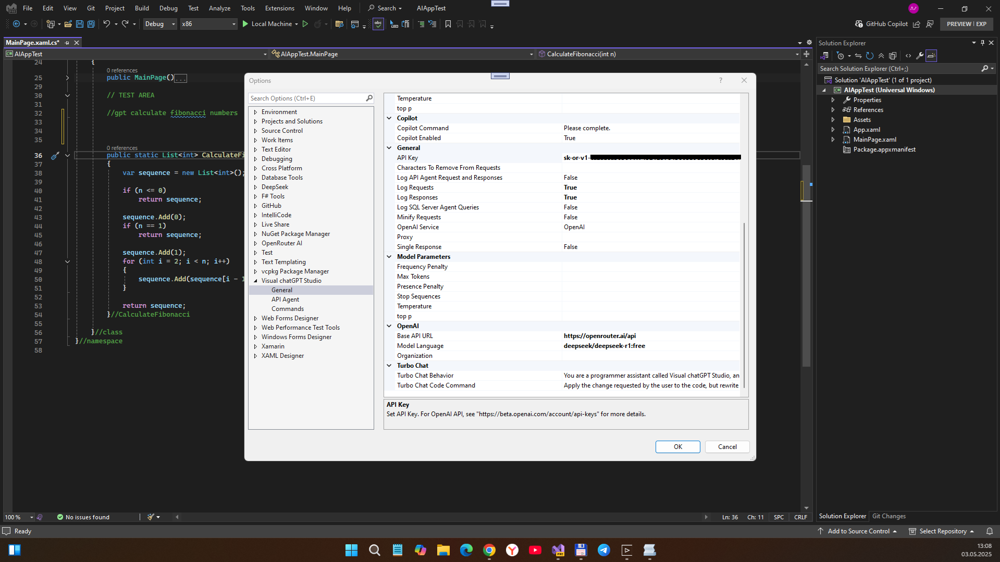
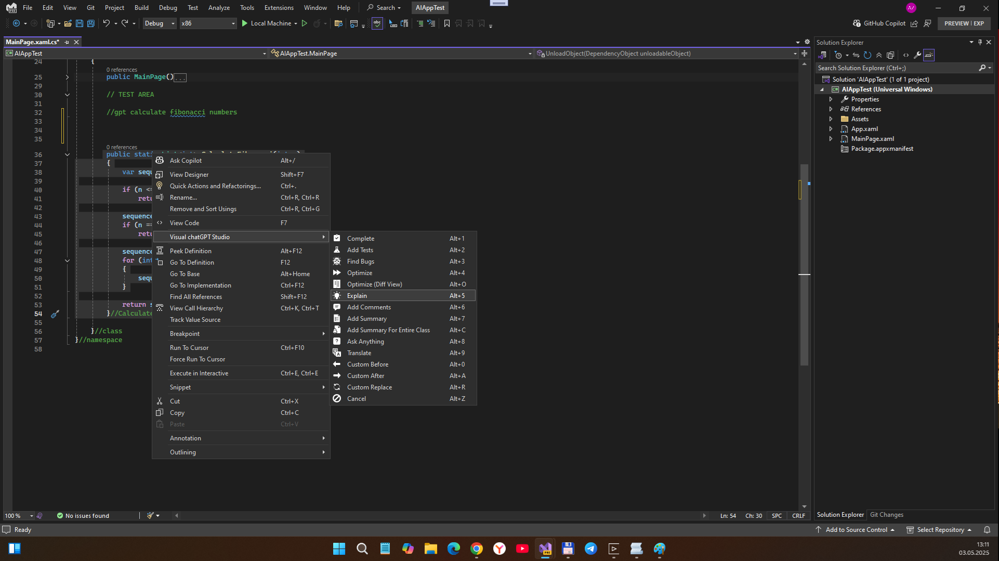
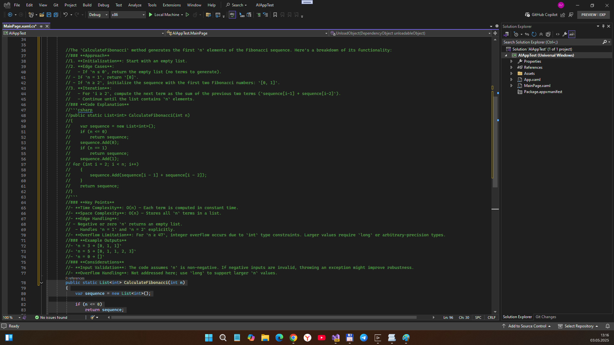

# VisualChatGPTStudio ("VisualAI2025" codename) - master branch

## Description
Visual chatGPT Studio is a powerful extension that integrates advanced AI capabilities directly into Visual Studio, enhancing your coding experience. This extension provides a suite of tools that leverage AI to assist you in various coding tasks. 

With Visual chatGPT Studio, you can receive intelligent code suggestions, generate unit tests, find bugs, optimize code, and much more—all from within your development environment. The extension allows you to interact with AI in a way that streamlines your workflow, making coding more efficient and enjoyable.

## Screenshot(s)

screenshot #1: ChatGPT "substituted" by open-ai-compatible Deepseek-r1 free model

screenshot #2: Comment code request/ query

screenshot #3: Comment code response/answer

## My 2 cents
- Exploration original src code & original docs; Russian readme (look at/in Research folder)
- Adaptation (2019 reduction & 2022 preview testing ) for newest preview-version of VS IDE
- OpenRouter preset (look at screenshot #1)

## References
- https://github.com/jeffdapaz/VisualChatGPTStudio Original VisualChatGPTStudio project
- https://marketplace.visualstudio.com/items?itemName=jefferson-pires.VisualChatGPTStudio Original VisualChatGPTStudio n VS Marketplace

## ..
As is. No support. RnD only. DIY.

## .
[m][e] May, 3 2025